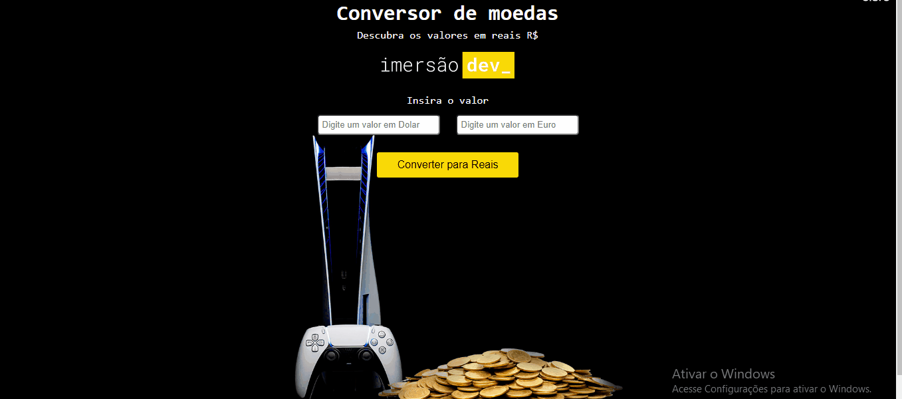
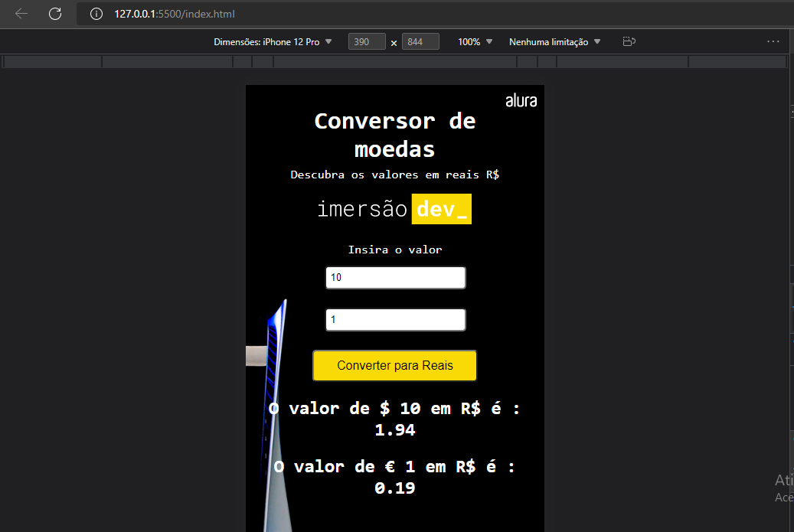

# Conversor de Moedas -Imersão Alura 💰

## 🎯Objetivo

Desenvolver um programinha para  convertar de Reais R$ em Dólares $ e Euros €

##  💻 Projeto Pronto

## 📱Versão Mobile

## 💻 Linguagens Utilizadas
1. HTML
2. CSS
3. JAVASCRIPT

## 💻 Como rodar esse Projeto 
Na sua pasta desejada digite o comando git
~~~
git clone git@github.com:mari-moreira/Conversor-de-moedas-Imersao-Alura.git
~~~
 No arquivo *index.htm* clique duas vezes.

Feito com muito ❤ por Mari 

